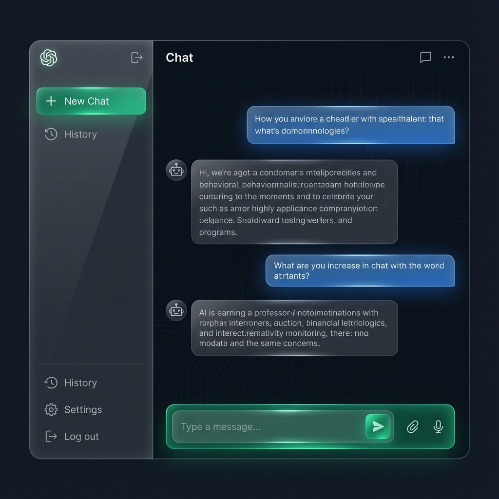

# 🤖 Josué Nanthakumar - Personal AI Assistant




**Josué AI** is a personal conversational assistant designed to showcase modern web development skills and AI integration. Built with **Next.js 14** and **Google Gemini**, it serves as a portfolio piece demonstrating expert-level UI/UX and real-time AI capabilities.

## ✨ Key Features

- **🧠 Advanced AI Integration**: Powered by Google Gemini 2.5 Flash for high-accuracy responses.
- **⚡ Real-time Streaming**: Instant response generation with character-by-character streaming.
- **💾 Chat History**: Automatically saves your conversations locally so you never lose context.
- **🎨 Premium UI/UX**:
    - **Glassmorphism Design**: Modern, translucent aesthetics with blur effects.
    - **Dark Mode Native**: Optimized for visual comfort.
    - **Responsive Layout**: Seamless experience across Desktop, Tablet, and Mobile.
- **🛑 Control**: Stop generation at any time.
- **📋 Productivity**: One-click copy for messages and code.

## 🛠️ Tech Stack

- **Framework**: [Next.js 14](https://nextjs.org/) (App Router)
- **Language**: [TypeScript](https://www.typescriptlang.org/)
- **Styling**: [Tailwind CSS](https://tailwindcss.com/) + `clsx` + `tailwind-merge`
- **AI SDK**: [Vercel AI SDK](https://sdk.vercel.ai/docs)
- **Icons**: [Lucide React](https://lucide.dev/)

## 🚀 Getting Started

### Prerequisites

- Node.js 18+
- Google AI Studio API Key

### Installation

1.  **Clone the repository**
    ```bash
    git clone https://github.com/JosueNANTHAKUMAR/Personal-Chatbox.git
    cd Personal-Chatbox
    ```

2.  **Install dependencies**
    ```bash
    npm install
    ```

3.  **Configure Environment**
    Create a `.env.local` file:
    ```env
    GOOGLE_GENERATIVE_AI_API_KEY=your_api_key_here
    ```

4.  **Run Development Server**
    ```bash
    npm run dev
    ```

    Open [http://localhost:3000](http://localhost:3000) to view the application.

## 🔮 Future Roadmap

- [ ] **RAG Integration**: Connect to personal documents/resume.
- [ ] **Voice Mode**: Speech-to-text and Text-to-speech.
- [ ] **Code Execution**: Run Python/JS snippets directly in the chat.

---

*Designed & Developed by [Josué Nanthakumar](https://github.com/JosueNANTHAKUMAR).*